# Note

## 概述

1. 分组交换：排队时延和分组丢失

   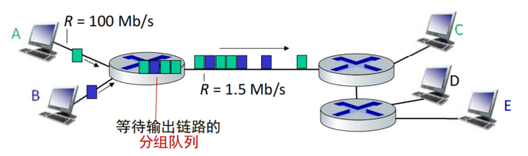

   分组排队：等待从输出链路发送

   分组丢失（丢包）：如果路由器中的缓存空间已填满，则到达的分组会被丢弃或选择将已经存在于路由器的分组丢弃

2. 电路交换：在端系统通信会话期间，预留了端系统研路径通信所需要的资源

   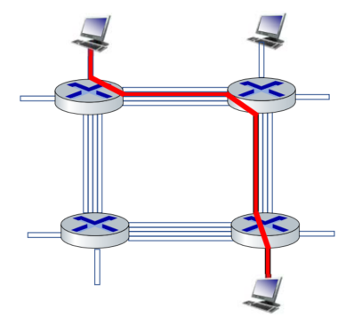

3. 分组交换与电路交换对比

   * 分组交换允许更多用户使用网络

4. 四种时延：

   

   * 节点处理时延：检测位错误，确定输出链路

   * 排队时延：在输出链路等待传输的时间（与路由器的拥塞程度相关）

     > 流量强度计算：
     >
     > - R：链路带宽 / 传输速率（bps，bits/s）  
     > - L：分组长度（bits）  
     > - a：分组到达队列的平均速率（pps，packets/s）  
     > - La：比特到达队列的平均速率（bps，bits/s）  
     >
     > $$
     > \text{流量强度} = \frac{La}{R}
     > $$

     流量强度描述了输入速率和输出速率的比值。流量强度大于 1 时，到达的分组超过最大服务能力

     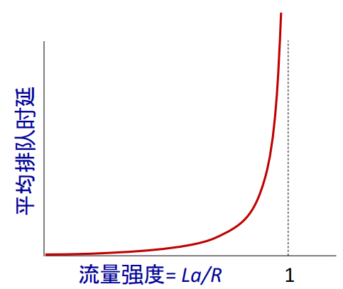

   * 传输时延：若分组长度位 L bits，链路带宽为 R bps，则时延为 $\frac{L}{R}$

   * 传播时延：若物理链路长度为 d，传播速度为 s，则传播时延为 $\frac{d}{s}$

5. 丢包：路由器缓冲区满了就会导致分组丢弃

6. 吞吐量：单位时间内通过某个网络（信道或接口）的实际数据量

   * 带宽是吞吐量的理论上限

   路径上的链路限制了端到端的吞吐量

   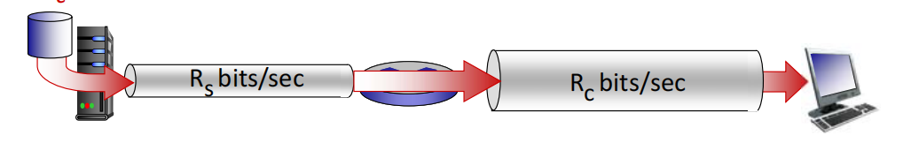

   吞吐量为 $min\{R_s,R_c\}$

7. 网络协议栈：

   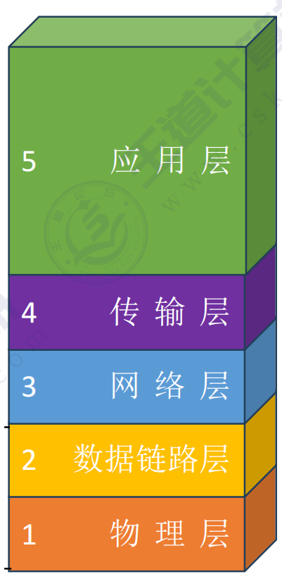

   * 应用层：支持网络应用
     * IMAP，SMTP，HTTP
* 传输层：处理数据传输
     * TCP，UDP
     
   * 网络层：完成数据报从源到目的的路由
  * IP，路由协议
  
* 数据链路层：相邻网络元素之间的数据传输
     * Ethernet，802.11 (WiFi)，PPP

   * 物理层：bits “on the wire”

8. 数据垂直传输视角

   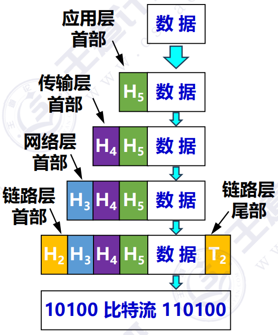

## 应用层

记不住，根本记不住

## 传输层

传输层服务 -> `多路复用和多路分解` -> UDP -> `可靠数据传输` -> TCP -> `拥塞控制原理` -> TCP 拥塞控制

****

### 传输层服务

1. 为不同的应用**进程**之间提供了**逻辑通信**

   * 依赖网络层的服务
     * 延时、带宽（传输层不可加强的服务）
   * 对网络层的服务进行增强
     * 数据丢失、顺序混乱、加密（传输层可加强的服务）

2. 可靠的、保序的传输：TCP

   - 多路复用、解复用  
   - 拥塞控制  
   - 流量控制  
   - 建立连接  

   不可靠、不保序的传输：UDP

   - 多路复用、解复用  
   - 没有为尽力而为的 IP 服务添加更多的其它额外服务

### 多路复用/多路解复用

1. 定义：

   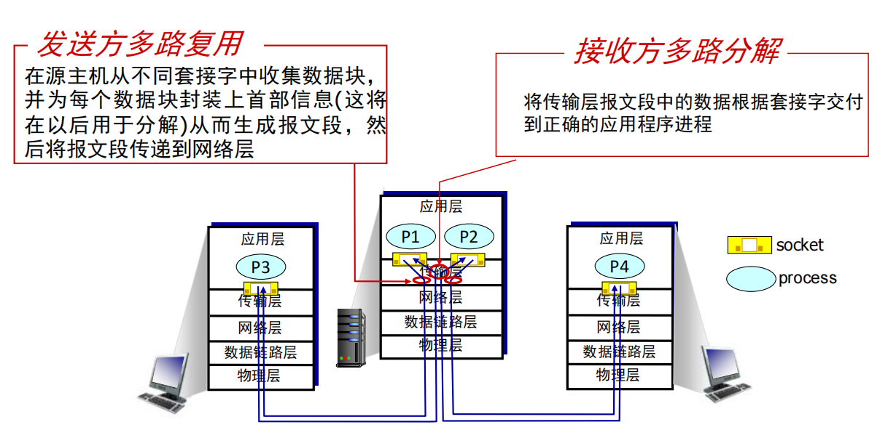

2. 无连接的多路分解：

   UDP 套接字包含：<目的 IP 地址，目的端口号>

   分解过程：只要两个 UDP 报文段具有相同的目的 IP 和目的端口号，那么这两个报文段将通过相同的目的套接字被定向到相同的目的进程

   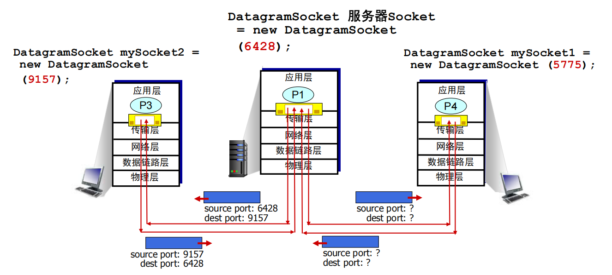

3. 面向连接的多路分解：

   TCP 套接字包含：<源IP地址，源端口号，目的IP地址，目的端口号>

   分解过程：主机使用全部4个值来将报文段定向（分解） 到相应的套接字

   * 即使目的 IP 和目的端口号相同，但是源 IP 或源端口号不同，也会被分发到不同进程

   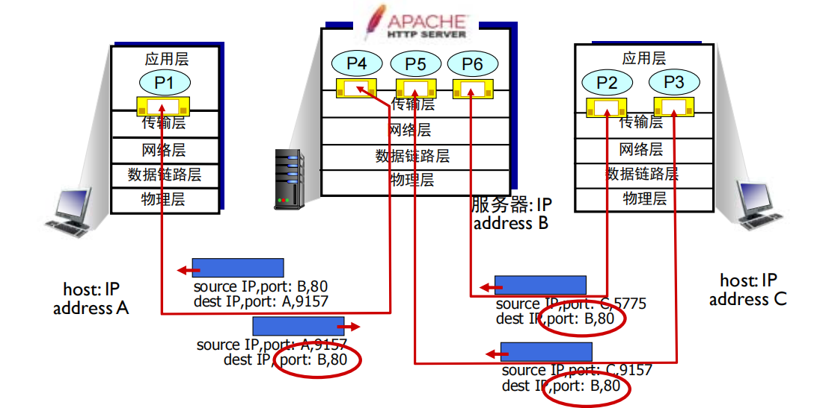

### UDP

1. UDP：提供尽力而为的服务（无连接）

   * 可能丢包、对应用程序交付失序
   * 分组首部开销小
   * UDP能够尽可能快地传输

   > 如果需要进行可靠传输，需要再应用层实现

2. UDP 应用：流式多媒体应用（丢包容忍，速率敏感）、DNS、SNMP、HTTP/3

3. UDP 报文段：

   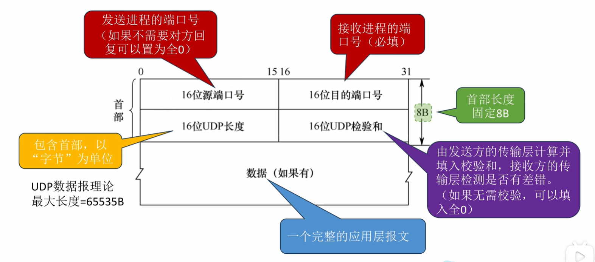

4. 传输示例：

   

5. UDP 检验：

   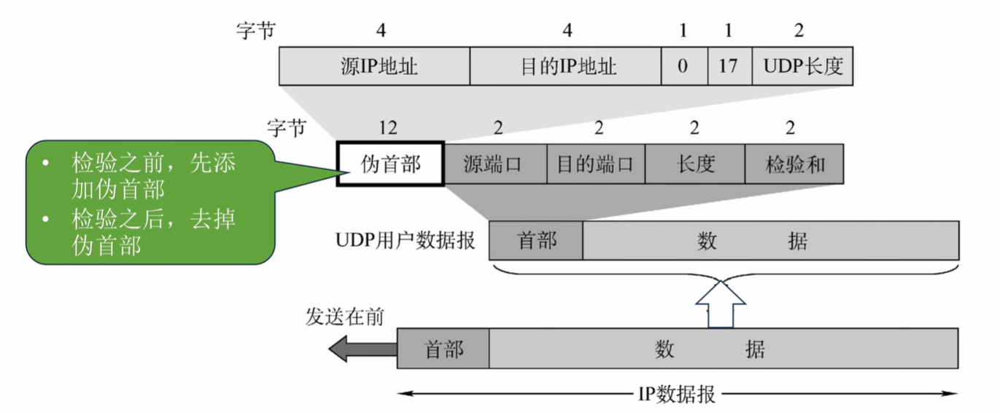

   发送方：

   1. 先把全 0 放入检验和字段
   2. 再把伪首部和 UDP 数据报看成是许多 16 位的字符接起来。若数据部分不是偶数个字节数，则要再末尾填入一个全 0 字节（此字节不发送）
   3. 按照二进程反码加法的方式计算出所有 16 位字的和（包括伪首部、UDP 首部、数据），求和过程要回卷
   4. 将和取反填入检验和字段

   接收方

   1. 先添加伪首部和末尾补 0
   2. 将所有字段（包括伪首部、首部、数据）按照二进程反码加法的方式计算出所有 16 位字的和，求和过程要回卷
   3. 若结果非全 1，说明出错；若结果是全 1，未检测到错误（依旧可能有错）

   这是一种弱检验方案

6. UDP 检验和计算过程

   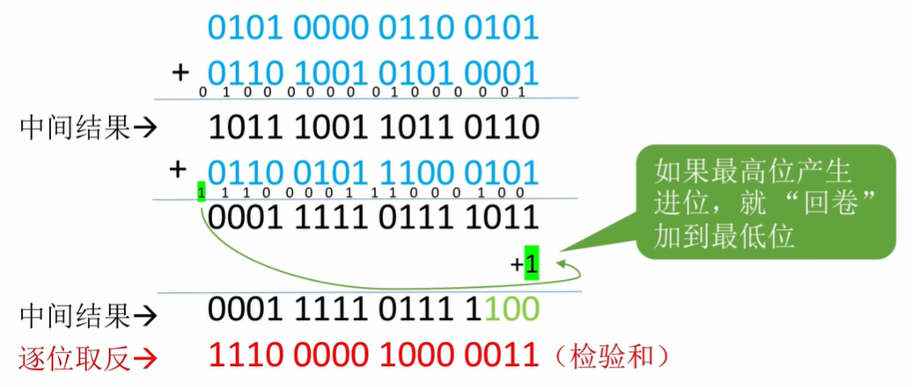

### 可靠数据传输

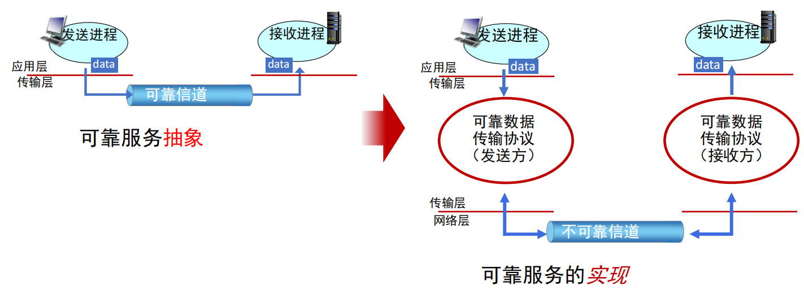

#### 停等协议

##### rdt 1.0：经完全可靠信道的可靠数据传输

1. 底层信道非常可靠  

   - 无比特差错  
   - 无分组丢失

2. 发送方的有限状态机

   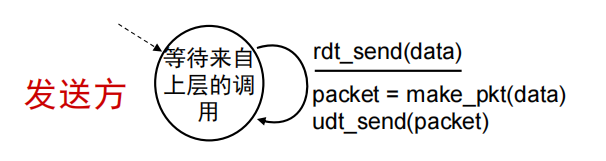

3. 接收方的有限状态机

   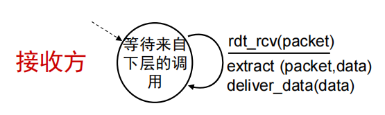

##### rdt2.0：经具有比特差错信道的可靠数据传输

1. rdt2.0：不考虑丢包，只考虑发送的数据包出现比特差错的情况

2. 停等协议（Stop-and-Wait）：发送方发送一个分组，然后等待接收方响应。

3. 机制：

   * 肯定确认（ACK）：接收者告知发送方 pkt 正确接收  
   * 否定确认（NAK）：接收者告知发送方 pkt 存在差错  
   * 发送方在收到 NAK 反馈后重新传输（retransmits）

4. 发送方有限状态机

   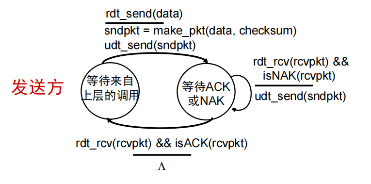

5. 接收方有限状态机：

   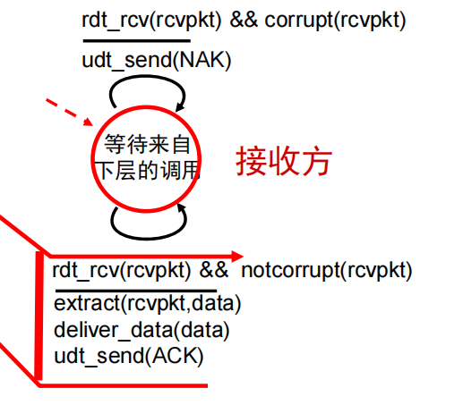

6. 存在的问题：如果 ACK/NAK 受损，发送方不知道接收方发生了什么情况。如果选择重传，则可能引入冗余分组

   * 如果发送方成功接收，但 ACK/NAK 受损，重传数据包会导致冗余

##### rdt2.1：引入序号标记数据

1. rdt2.1：不考虑丢包，只考虑发送的数据包和返回的 ACK、NAK 有比特差错的情况

2. 机制：引入 {0，1} 两个序号标记数据

   * 接收方通过序号来判断这个数据是否是冗余的

3. 发送方有限状态机：

   

4. 接收方有限状态机：

   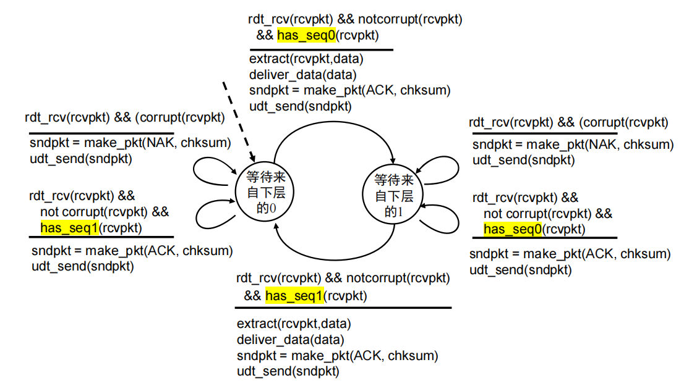

##### rdt2.2：丢弃 NAK

1. 机制：在 rdt2.1 的基础上，用冗余 ACK 来替代 NAK 功能

   * 当发送方收到冗余 ACK，就重传当前分组

2. 发送方和接收方有限状态机的片段：

   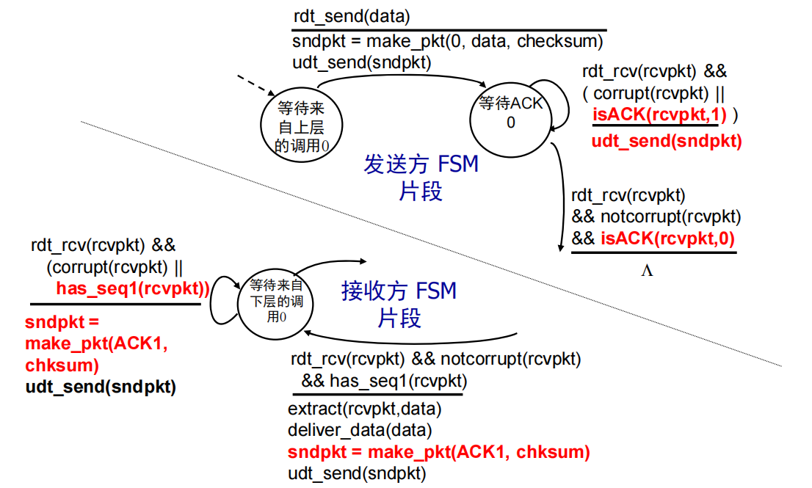

##### rdt3.0：具有比特差错和丢包的信道

1. rdt3.0：同时考虑比特差错和丢包

2. 机制：引入超时计时器

3. 如果超时计时器设计的不合理（如超时时间设计的比 RTT 短），也可以正常工作

   * 此时会重传冗余的数据，但是序号会使接收方正确处理数据
   * 但是会降低传输的性能

4. 发送方有限状态机：

   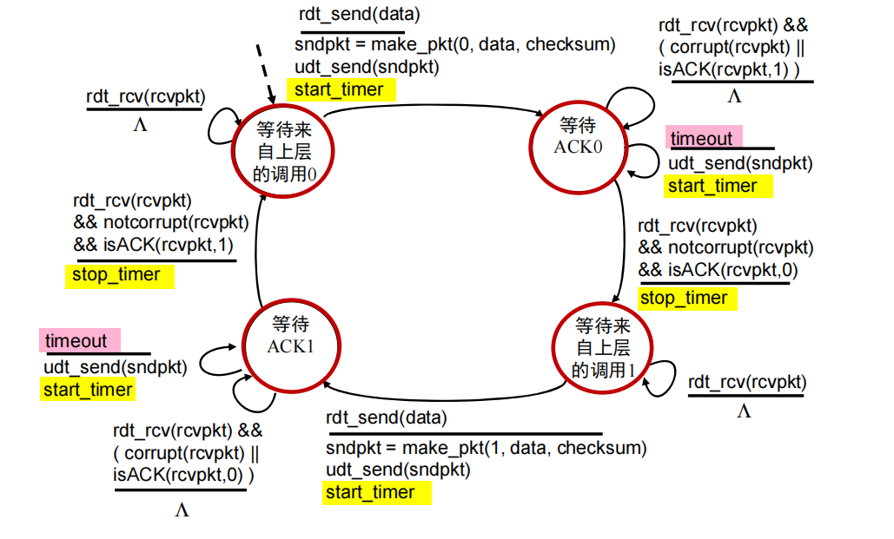

5. rdt3.0 运行情况：

   正确情况：

   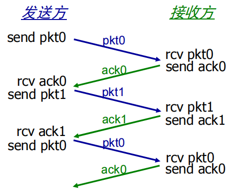

   数据传输丢包：

   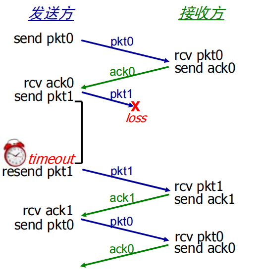

   ACK / NAK 丢包：

   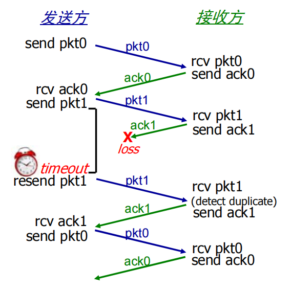

   超时时间设置不合理：

   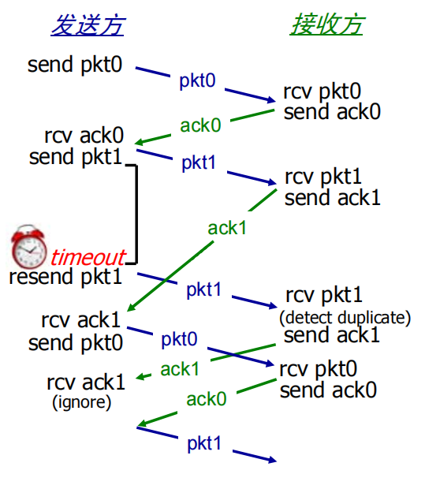

6. rdt3.0 的性能：

   

   链路的利用率非常低

#### 流水线协议

##### 回退 N 步协议（GBN）

##### 选择重传协议（SR）

### TCP

### 拥塞控制原理

### TCP 拥塞控制

## 网络层——数据平面

`概述` -> 路由器内部工作原理 -> 网际协议 -> `通用转发` -> 中间盒子

****

### 网络层服务

1. 网络层服务和协议

   * 主机之间的逻辑通信
   * 转发、路由选择

2. 数据平面：本地，转发动作

   控制平面：全网，确定路由

   * 传统路由算法、SDN 方法

3. 因特网采用尽力而为服务模型，不保证：

   1. 分组一定能成功送达目的地
   2. 端到端的时延与顺序
   3. 端到端流量的最小带宽

### 路由器内部工作原理

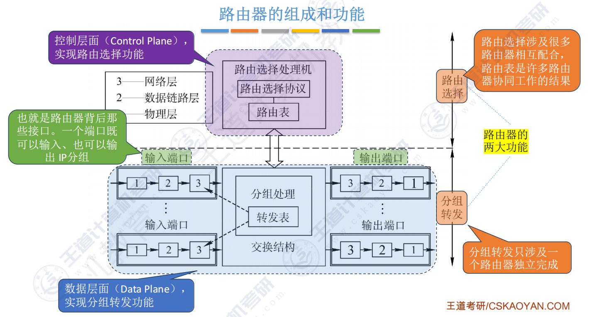

1. 使用头字段值匹配转发表查找输出端口

2. 基于目的转发：仅基于目标 IP 地址（传统）进行转发

   通用转发：基于任何一组头字段值进行转发

3. 最长前缀匹配原则：在查找给定目标地址的转发表条目时，使用与目标地址匹配的最长地址前缀。

4. 交换结构的三种主要类型：

   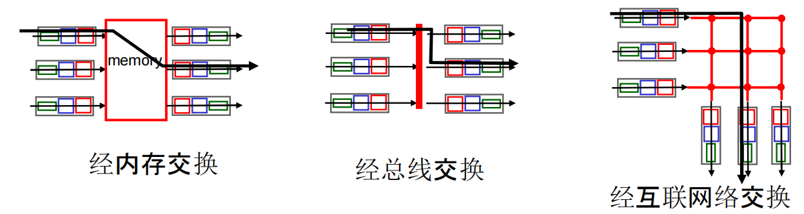

   * 经内存交换：分组被复制到处理器内存中，每个分组需要穿越两次系统总线

     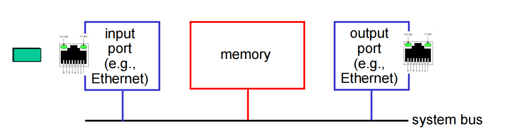

   * 经总线交换：存在总线竞争

   * 经互联网络交换：加速、并行扩展

5. 输入端口排队：当交换网络的处理速度低于所有输入端口速率之和时，分组将在输入端口队列中排队。

   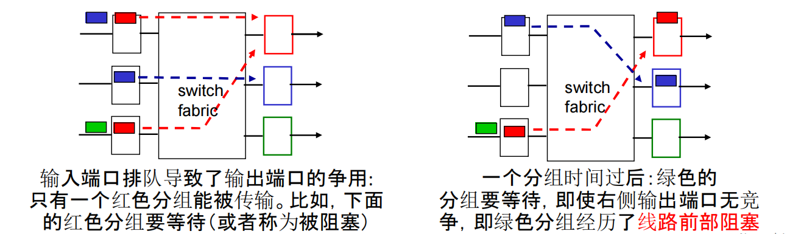

6. 输出端口排队：当交换速度超过输出线路的速率时，需要进行缓存

   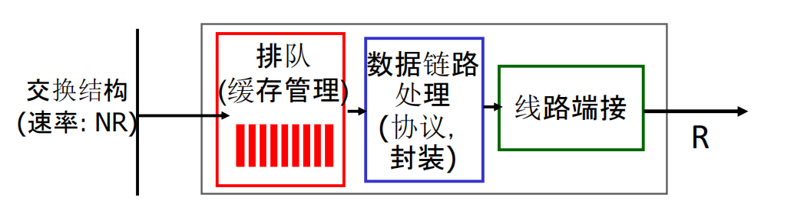

7. 分组调度：

   * 先来先服务（FCFS）：分组按顺序传输到输出端

   * 优先权排队：到达输出链路的分组被分类，按类别排队，具有缓存分组的最高优先权类中传输一个分组

     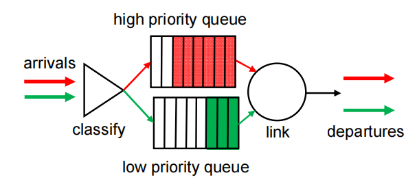

   * 循环排队：到达输出链路的分组被分类，并按类别排队。循环调度器周期性地重复扫描各类队列，依次从每个非空类发送一个完整分组。

     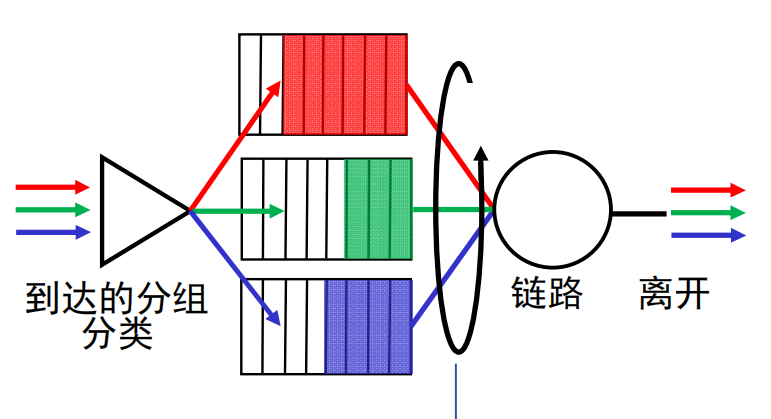

   * 加权轮询排队：每个类别 $i$ 分配权重 $W_i$，在一个调度周期内，类别 $i$ 获得的服务比例为 $\frac{W_i}{\sum_j W_j}$

     即使所有类别都有分组排队，类别 $i$ 仍能保证获得的最小带宽为：$R \times \frac{W_i}{\sum_j W_j}$

### 网际协议

1. IPv4 数据报格式：

   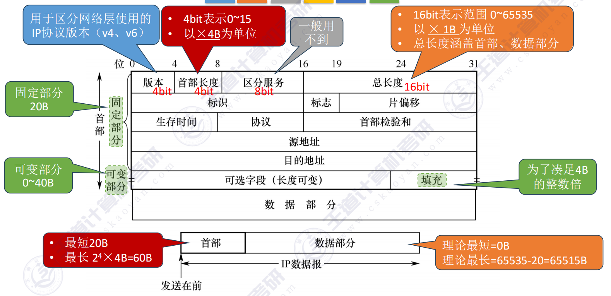
   
   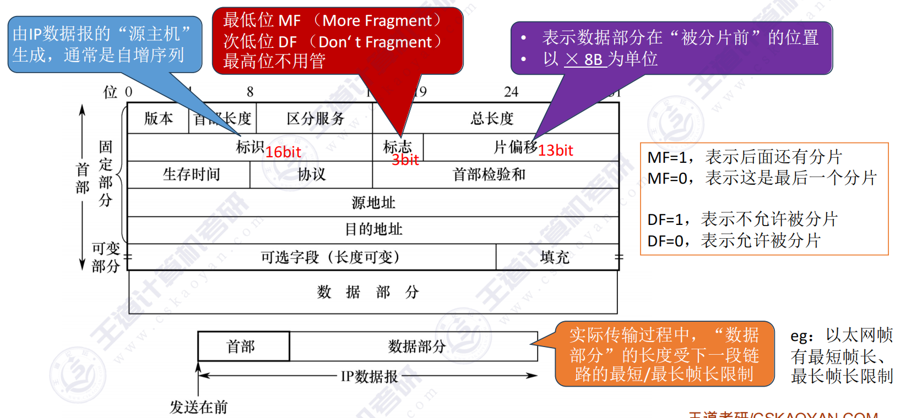
   
   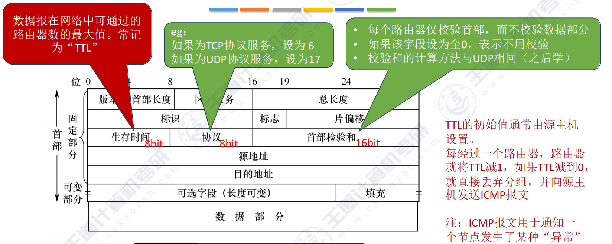
   
   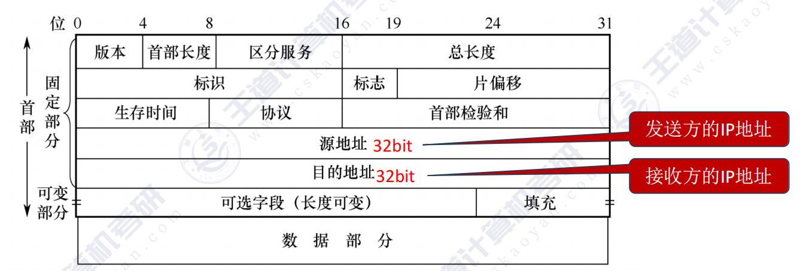
   
2. 子网：将每个接口与其主机或路由器分离，创建隔离网络的“孤岛”

   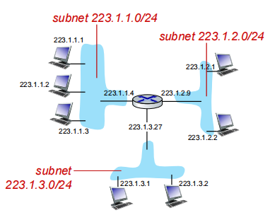

3. IPv4 编制：无类别域间路由选择（CIDR）

   * IP 地址中的任意长比特数作为网络部分
   * 地址格式：a.b.c.d/x，其中 x 是网络地址的比特数

4. DHCP：为刚接入网络的主机动态分配 IP 地址、配置默认网关、配置子网掩码

   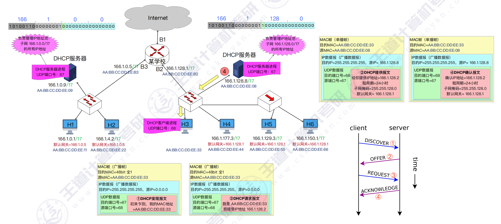

5. DHCP 是应用层协议，使用 UDP 提供的服务

   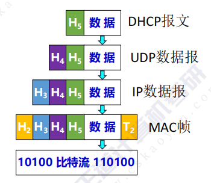

6. 路由聚合：

   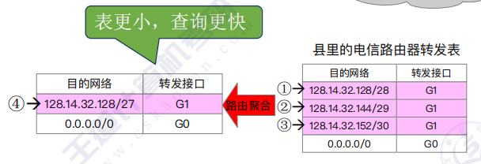

7. 网络地址转化（NAT）：

   私有地址范围（仅用于局域网，不得在互联网上路由）：

   - 10.x.x.x/8（`10.0.0.0` – `10.255.255.255`）
   - 172.16.x.x/12（`172.16.0.0` – `172.31.255.255`）
   - 192.168.x.x/16（`192.168.0.0` – `192.168.255.255`）

   NAT 路由器：转发 IP 数据报时，进行内网 IP 与外网 IP 的相互转换。

   * NAT 表：记录地址转换关系
     `<内网 IP : 端口号> ↔ <外网 IP : 端口号>`
   * 从内网→外网：替换源 IP 地址、源端口号  
   - 从外网→内网：替换目的 IP 地址、目的端口号

   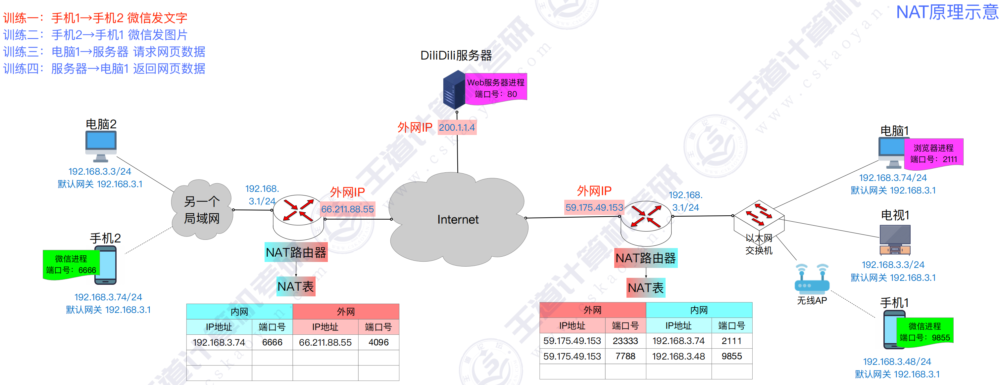

8. IPv6 数据报格式：

   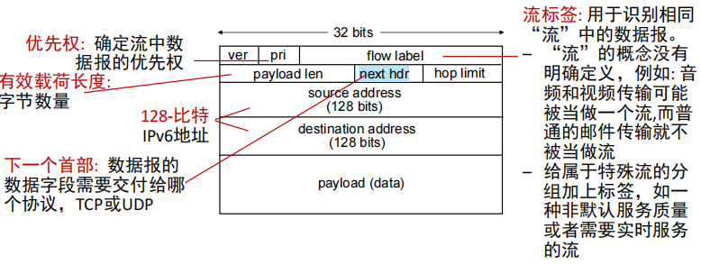

9. IPv4 和 IPv6 的区别

   * IPv6 无检验和
   * 没有分片/重组
   * 无可选字段（可能出现在下一个首部）

10. IPv4 向 IPv6 的过渡：隧道技术

    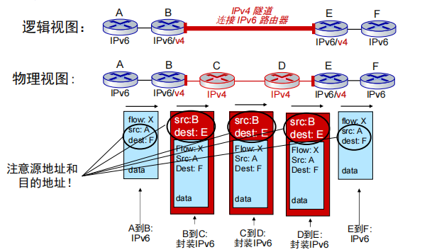

## 网络层——控制平面

概述 -> 路由选择算法 -> OSPF -> BGP -> `SDN` -> ICMP -> `网络管理`

### 路由选择算法

1. 静态：路由随时间变化缓慢，通常人工进行调整
2. 动态：路由变化更快
   * 随着网络流量负载或拓扑变化而改变路由选择路径
   * 周期性更新或响应链路开销变化
   * 受路由选择循环、路由振荡问题的影响
3. 分散式：迭代的计算过程，与邻居交换信息
   * 路由器初始时只知道相连邻居的链路开销
   * 距离向量算法
4. 集中式：所有路由器都具有完整的拓扑和链接开销信息
   * 链路状态算法

#### 链路状态算法

1. 当链路开销用链路上的流量衡量，会发生链路振荡

#### 距离向量路由选择算法

1. 基于 Bellman-Ford 方程
2. 好消息传得快，坏消息传得慢

#### OSPF

#### RIP

#### BGP

#### ICMP

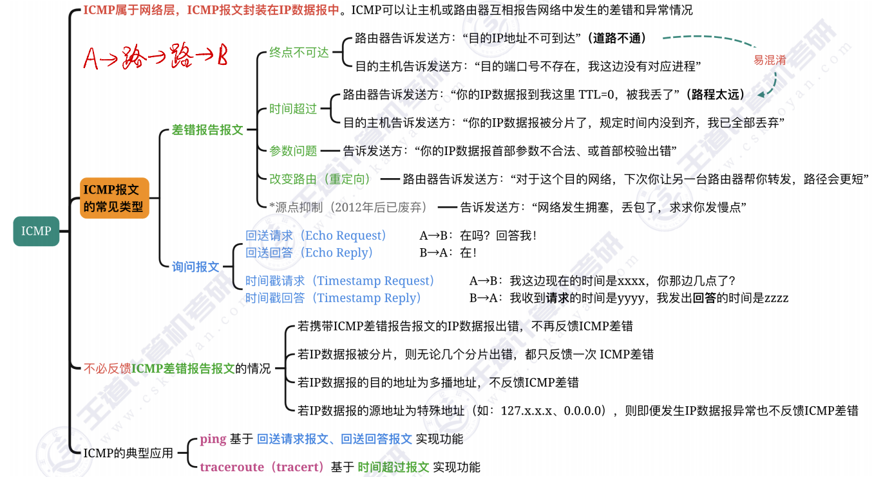

## 链路层

概述 -> 差错检测和纠正技术 -> 多路访问链路和协议 -> 局域网 -> `链路虚拟化` -> 数据网络中心 -> `Web 网页请求的历程`

****

### 差错控制和纠正技术

1. 奇偶校验：

   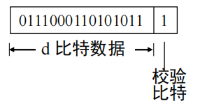

   奇校验：d + 1 比特中的 1 的个数为奇数

   偶校验：d + 1 比特中的 1 的个数为偶数

2. 二维奇偶校验：

   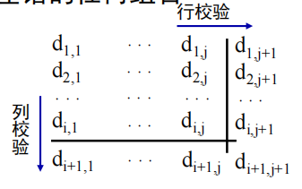

   可检验和纠正单比特错误，可检验但不能纠正 2 比特差错的任何组合

3. 校验和

4. ==循环冗余检测==（看王道）

### 多路访问链路和协议

#### 信道划分协议

1. 时分复用（TDMA）：

   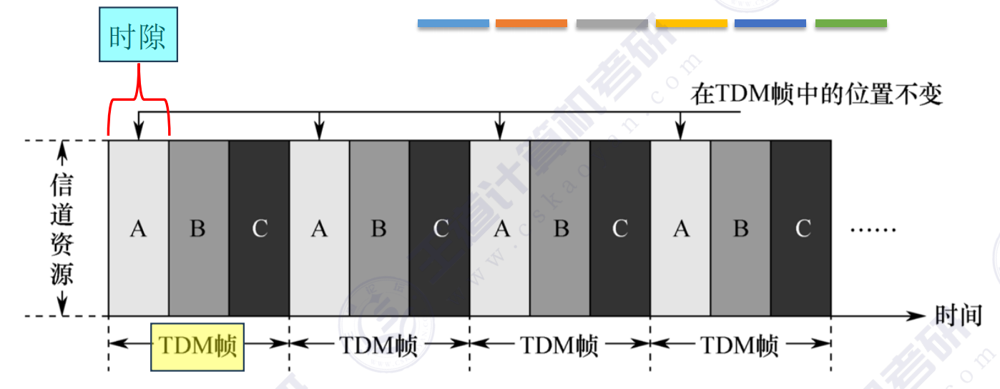

2. 频分复用（FDMA）：

   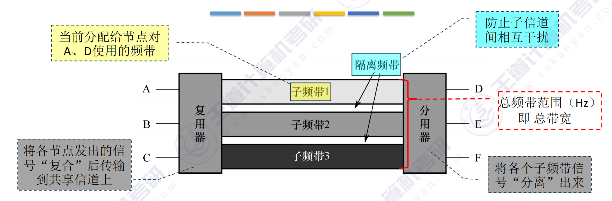

3. 码分复用（CDMA）：

   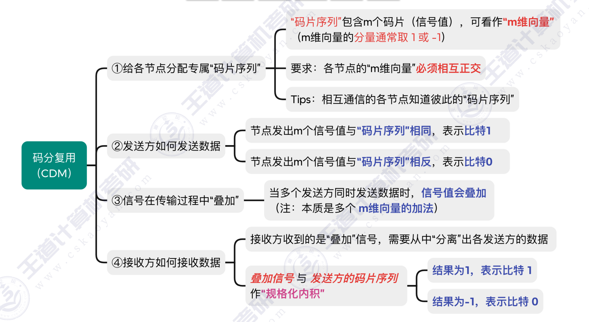

#### 随机接入协议

1. 纯 ALOHA：

   * 数据准备好就立即发送

   <table rules="none" align="center">
   	<tr>
   		<td>
   			

                   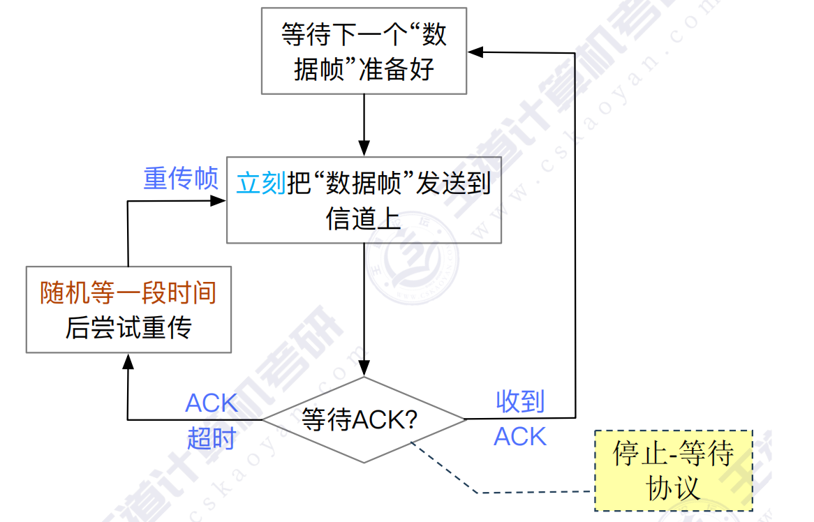
   				 
   			

   		</td>
   		<td>
   			

                   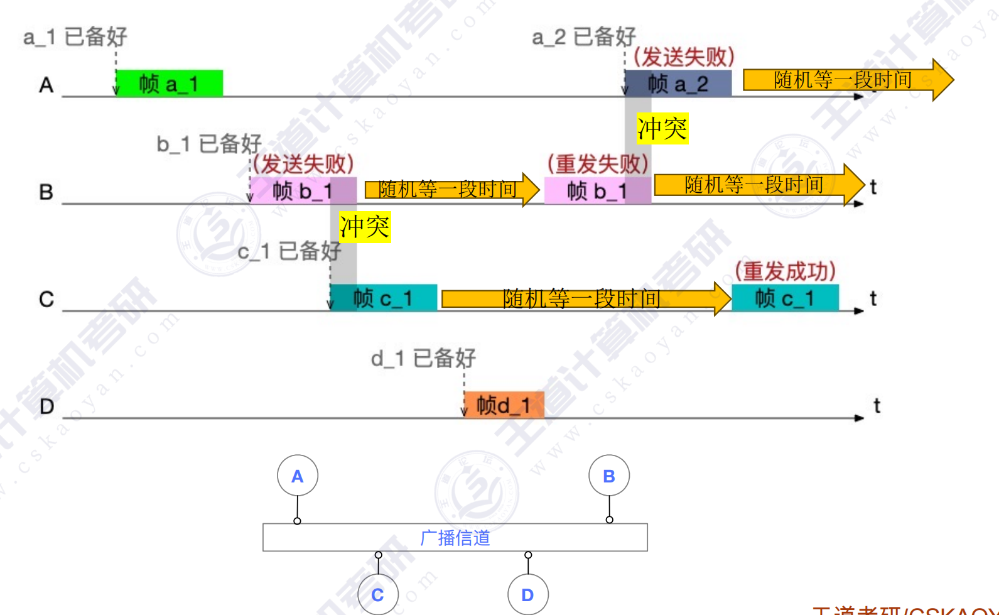
   				 
   			

   		</td>
   	</tr>
   </table>

2. 时隙 ALOHA：

   <table rules="none" align="center">
   	<tr>
   		<td>
   			

                   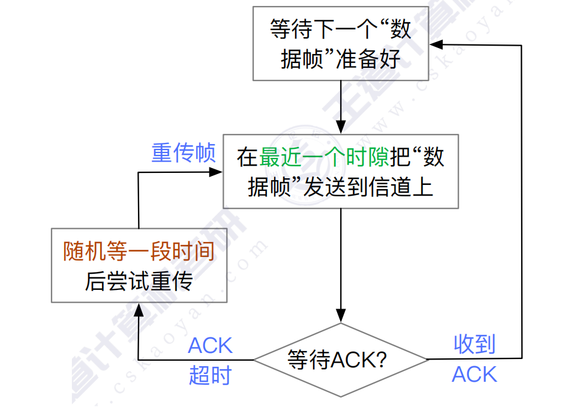
   				 
   			

   		</td>
   		<td>
   			

                   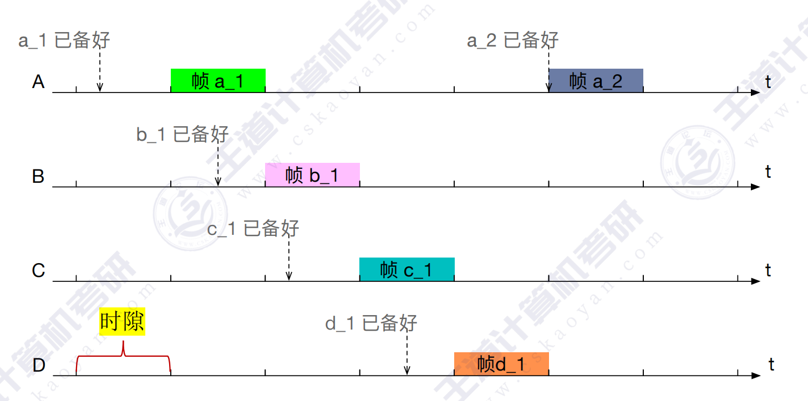
   				 
   			

   		</td>
   	</tr>
   </table>

3. CSMA（载波侦听多路访问）

   * 在发送数据之前，先监听信道是否空闲，只有信道空闲，才会尝试发送数据

   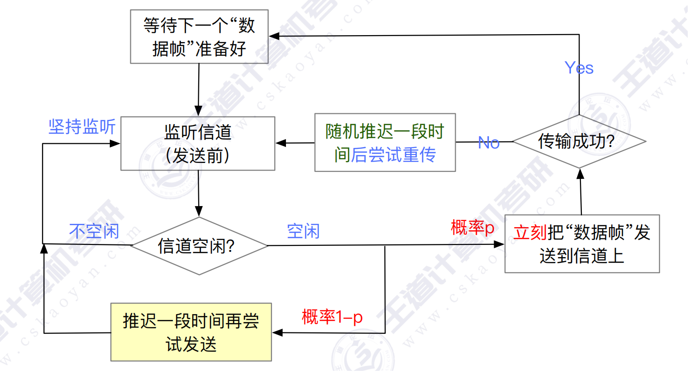

4. CSMA/CD

   * 传输过程中，网络适配器持续监听信道，检测来自其他适配器的信号能量。  

     若在整个帧传输期间未检测到其他适配器的信号能量，则该网络适配器成功完成该帧的发送。

     如果网络适配器在传输过程中检测到来自其他适配器的信号能量，它中止传输

   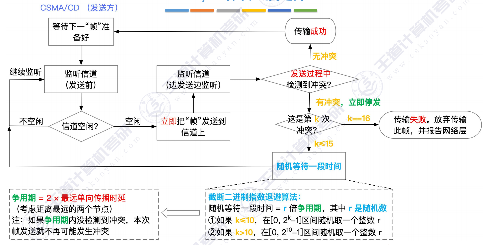

   * ==**在以太网协议中，随机等待的时间为 $r \times 512 \text{比特时间}$，512 比特时间即发送 512 比特进入以太网需要的时间。**==

#### 轮流协议

1. 轮询协议：主节点“邀请”其他节点依次进行传输。  

   * 主节点以轮询方式循环各结点：

     向结点 1 发送报文，告知其可传输的最大帧数

     结点 1 传完若干帧后，主节点再通知结点 2 可传输的最大帧数

     依此类推，顺序周而复始。

   * 缺点：

     轮询开销

     若只有一个活跃节点，仍然要轮询每个非活跃节点，造成开销

     单点故障（主节点）

   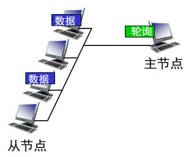

2. 令牌传递协议：

   * 无主节点
   - 一个称为令牌（token）的小型特殊帧按固定顺序在节点间循环传递  

   节点收到令牌后：  

   * 若有帧待发，则发送最多允许数量的帧，随后将令牌转发给下一节点

   - 若无帧待发，则立即将令牌转发给下一节点

   缺点
   - 令牌维护开销  
   - 传递时延  
   - 单点故障：
     - 任一节点失效可能导致整个信道崩溃  
     - 节点忘记释放令牌时，需额外机制使令牌重新进入循环

   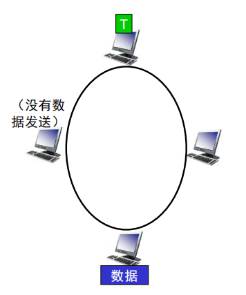

### 局域网

1. MAC 地址（又称局域网地址、物理地址、以太网地址）：本地使用，用于把帧从一个接口送到同一子网内另一物理连接的接口。 

2. LAN 中每个接口：

   * 拥有唯一的 48 位 MAC 地址
   * 拥有唯一的 32 位本地 IP 地址

3. ARP 协议：

   * ARP 表：存储 IP 地址到 MAC 地址的影视

     `<IP address; MAC address; TTL>`

     TTL 存储了该表项过多久会被删除

4. ARP 协议执行过程：（ARP 协议的执行过程看王道）

   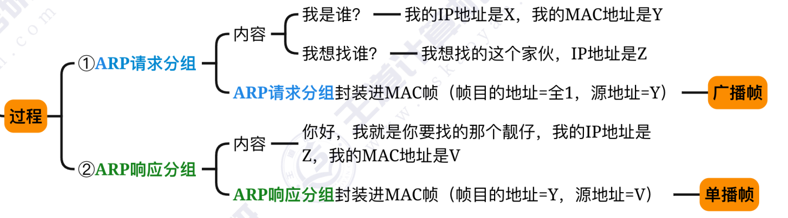

5. 以太网的物理拓扑：

   

6. 曼彻斯特编码

7. 以太网帧：

   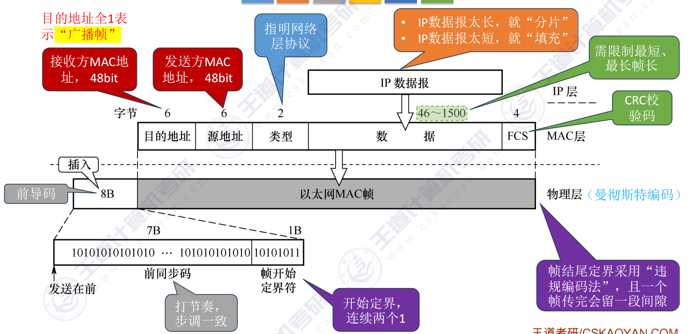

8. 以太网：不可靠，无连接，采用无时隙的、使用二进制指数回退的 CSMA/CD 协议

9. 802.3（有线）以太网标准：链路层 & 物理层

   不同的物理层介质：光纤，铜线

   

10. 交换机：链路层设备，存储转发以太网帧

    * 使用 CSMA/CD 协议

      * 主机与交换机之间有专用、直接的连接，因此无碰撞（隔离了冲突域），每个链路是它自己的冲突域

      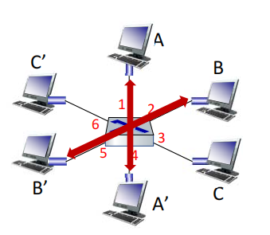

      * A-to-A’ 和 B-to-B’ 可以同时传输

      * A-to-A’ 和 C-to-A’ 不能同时传输

    * 透明的，主机不知道交换机的存在

    * 即插即用，自学习

11. 交换机表（自学习，看王道）

    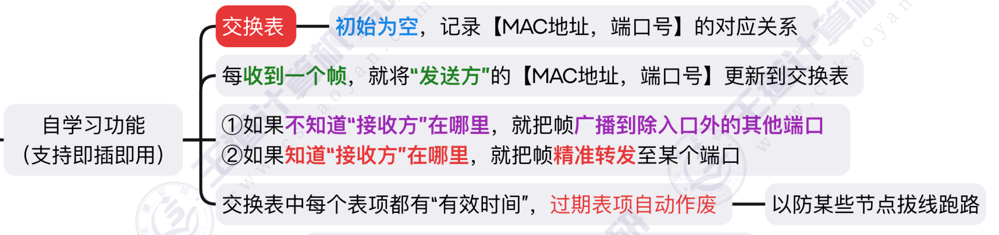

12. 交换机：帧过滤与转发

13. VLAN：虚拟局域网

    * 隔离广播域

### 无线网络

1. 无线网络分类：

   有基础设施模式：主机通过基站连接到有线网络

   自组织模式：没有基站

   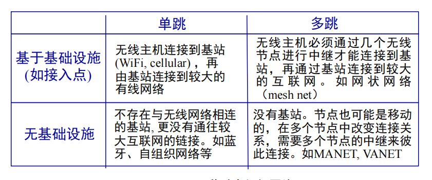

2. 无线链路特征：

   * 递减的信号强度
   * 来自其它源干扰
   * 多径传播

   * **==隐蔽站问题==**：导致无法采用 CSMA/CD 协议

3. 码分多址（CDMA）

4. 802.11 无线局域网：基本构件是基本服务集（BSS）

   * 一个 BSS 包括：1 个或多个无线站点，1 个接入点（AP，即基站），无线站点与基站的通信

   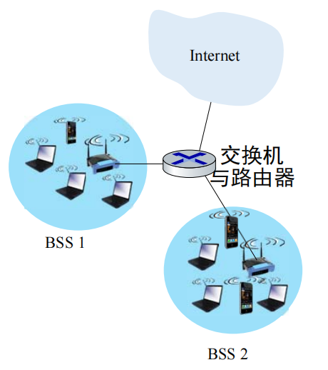

5. 新加入的节点必须与 AP 关联：

   AP 扫描信道，周期地发送信标帧，节点选择 AP 并与之关联；如果有需要，进行认证

   主动扫描与被动扫描

   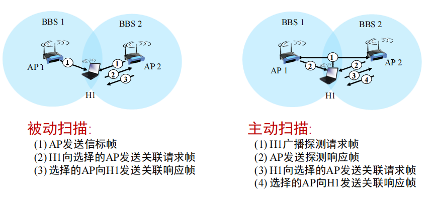

6. CSMA/CA（带碰撞避免的 CSMA）（802.11）

   机制：

   1. 若检测到信道空闲：等待一段分布式帧间间隔（DIFS） 后，传输整个帧（不进行碰撞检测）。  
   2. 若检测到信道忙：选取一个随机回退值（用指数退避算法），信道空闲时递减该值，信道忙时暂停计数；计数值减至 0 时，发送整个数据帧并等待确认（由于隐蔽站问题，ACK 是必须的）
      1. 收到确认：仍有数据要发 → 回到步骤 1。  
      2. 未收到确认：重新进入回退阶段，从更大范围内再选随机值重复计数。

   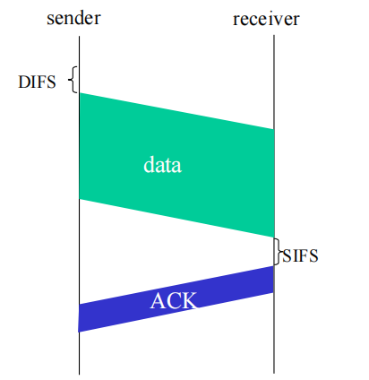

7. CSMA/CA 的碰撞避免方案（非必须的）：RTS-CTS 交换

   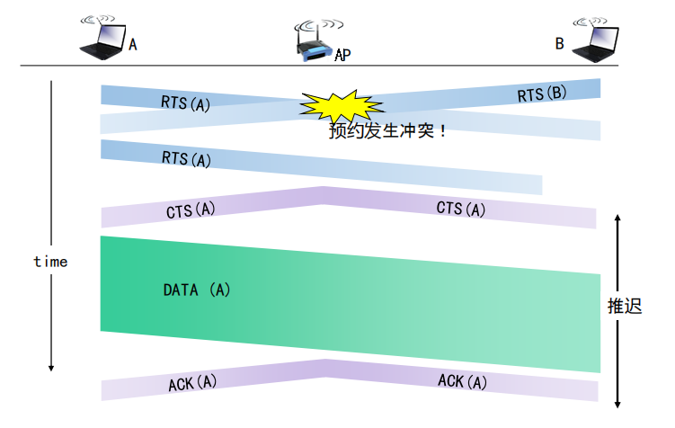

8. 802.11 帧结构：

   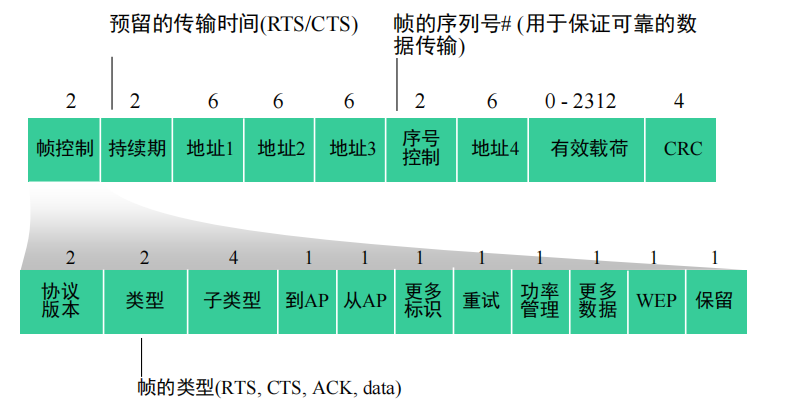

   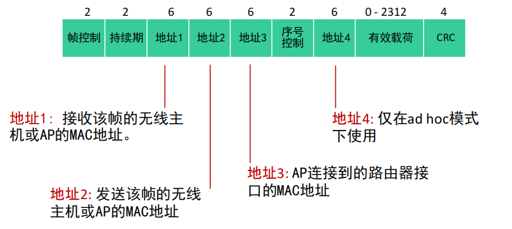

9. 802.11：同一个子网中的移动

   交换机通过自学习，移动的终端 IP 地址不需要改变